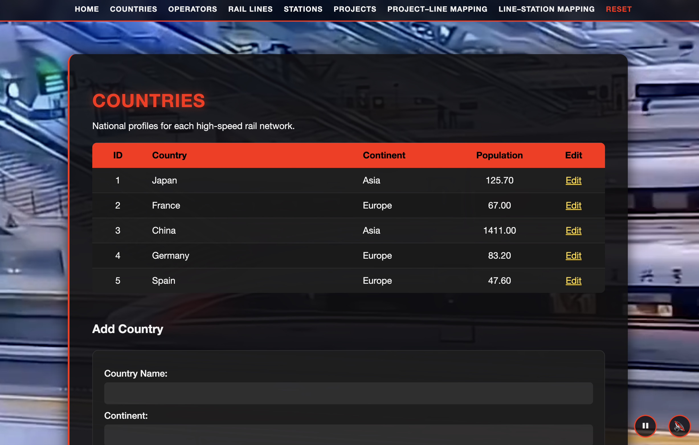
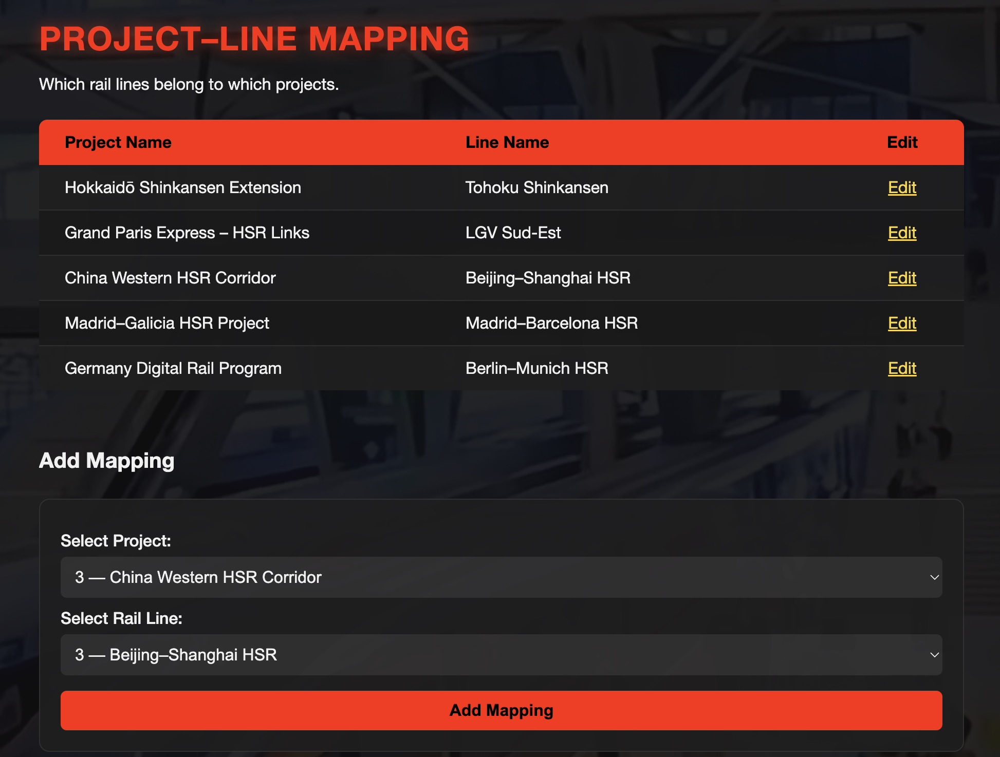

<p align="center">
  
</p>

---

# Global High-Speed Rail Infrastructure Database


A full-stack web application for managing global high-speed rail infrastructure. Built with Node.js, Express, and MySQL, this project demonstrates normalized database design, complex relationship management, and a polished user interface with stored procedures handling all data modifications.

Developed as a term project for **CS340 – Introduction to Databases** at Oregon State University.

**Live Demo:** https://globalhsrdatabase-production.up.railway.app/

---

## Overview

The Global High-Speed Rail Infrastructure Database models the operational structure of major high-speed rail systems worldwide. The application provides an administrative interface to manage:

- Countries and their rail infrastructure profiles
- Rail operators and their operational details
- High-speed rail lines with technical specifications
- Station networks and geographic distribution
- Construction projects and their relationships to rail lines
- Complex many-to-many relationships between entities

Key features include full CRUD operations with referential integrity enforcement, dynamic form interactions, and a polished, cyberpunk-inspired user interface.

This project emphasizes real-world relational modeling over toy datasets, mirroring the complexity of production database systems.

### Screenshots

<p>
  <b>Entity Management (CRUD)</b><br/>
  <p>
  
</p>

<p>
  <b>Many-to-Many Mapping</b><br/>
  <p>
  
</p>


---

## Tech Stack

**Backend**
- Node.js with Express.js
- MySQL / MariaDB with stored procedures
- Express-Handlebars templating
- Promise-based database connections

**Frontend**
- Handlebars server-side rendering
- Vanilla JavaScript for dynamic interactions
- Custom CSS3 with CSS Grid and Flexbox
- Responsive design with visual feedback systems

**Database**
- Normalized relational schema (3NF)
- Stored procedures for all CREATE/UPDATE/DELETE operations
- Complex many-to-many relationships
- Referential integrity constraints

---

## Repository Structure

```
global_hsr_database/
│
├── project/                    # Application source code
│   ├── app.js                  # Main Express application
│   ├── package.json            # Dependencies and scripts
│   │
│   ├── database/
│   │   ├── db-connector.js     # Database configuration
│   │   ├── DDL.sql             # Schema definition
│   │   ├── DML.sql             # SELECT queries
│   │   └── PL.sql              # Stored procedures
│   │
│   ├── views/                  # Handlebars templates
│   │   ├── layouts/
│   │   └── *.hbs               # Page templates
│   │
│   └── public/                 # Static assets
│       ├── styles.css
│       ├── video/
│       └── audio/
│
└── docs/                       # Full documentation
    ├── README_CS340.md         # Academic documentation
    ├── Project Step 6.pdf      # Final project submission
    └── screenshots/            # Application screenshots
```

---

## Running Locally

### Prerequisites
- Node.js (v14.0.0 or higher)
- MySQL 5.7+ or MariaDB 10.3+
- npm (v6.0.0 or higher)

### Setup

1. **Clone the repository**
   ```bash
   git clone https://github.com/mjharris65/global_hsr_database.git
   cd global_hsr_database/project
   ```

2. **Install dependencies**
   ```bash
   npm install
   ```

3. **Configure database connection**
   
   (See .env.example for required variables):
   ```env
   DB_HOST=localhost
   DB_USER=your_username
   DB_PASSWORD=your_password
   DB_NAME=hsr_database
   PORT=3000
   ```

4. **Set up the database**
   ```bash
   mysql -u your_username -p < database/DDL.sql
   mysql -u your_username -p < database/PL.sql
   ```

5. **Start the application**
   ```bash
   npm start
   ```

6. **Access the application**
   ```
   http://localhost:2181/
   ```

---

## Key Features

- **Full CRUD Operations** - Complete create, read, update, and delete functionality for all entities
- **Stored Procedures** - All data modifications handled through MySQL stored procedures for security and integrity
- **Dynamic Relationships** - Manage complex many-to-many relationships with intelligent filtering
- **Enhanced UX** - Success/error feedback, smooth scrolling, form highlighting, and auto-population
- **Referential Integrity** - Automatic cleanup of dependent records and constraint validation
- **Professional UI** - Cyberpunk-inspired design with backdrop effects and ambient media

---

## Database Design

The application implements a normalized relational database (3NF) with five main entities and two intersection tables managing many-to-many relationships:

**Main Entities:**
- Countries
- Operators (rail service providers)
- Rail Lines
- Stations
- Projects (construction and upgrades)

**Relationships:**
- Countries → Operators (1:M)
- Countries → Stations (1:M)
- Operators → Rail Lines (1:M)
- Rail Lines ↔ Stations (M:N)
- Projects ↔ Rail Lines (M:N)

For detailed schema information, entity-relationship diagrams, and database documentation, see [`docs/README_CS340.md`](./docs/README_CS340.md).

---

## Documentation

Comprehensive documentation is available in the [`docs/`](./docs) directory:

- **Full Academic Documentation** - Complete CS340 submission details
- **Database Schema** - Detailed entity descriptions and relationships
- **API Reference** - All routes and endpoints
- **Stored Procedures** - Complete procedure specifications
- **Usage Guide** - Step-by-step operational instructions
- **Deployment Notes** - OSU ENGR server deployment instructions

---

## Project Team

**Michael Harris** - Database design, backend development, UI/UX implementation  
**Francisco Yinug** - Database design, stored procedures, testing

**Course:** CS340 - Introduction to Databases  
**Institution:** Oregon State University  
**Term:** Fall 2025

---

## License

This project is licensed under the MIT License. See the [LICENSE](LICENSE) file for details.
